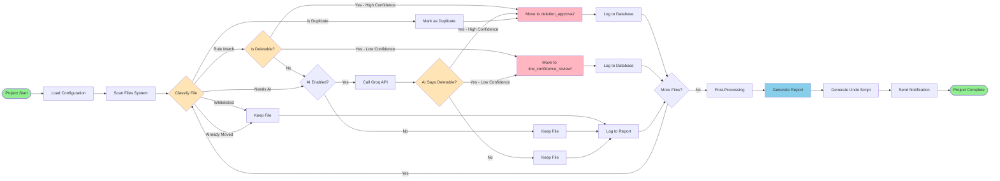

# heysailboat/filecleaner
**An AI-powered file sorter and cleaner, made with AI.**

This README provides information on the project's purpose, prompt, function/how it works, a findings/performance review, and a final classification of AI performance.

Once I have a working output from one of the models, I'll also add a "instructions" section and make a release.

*Note: this README is (almost\*) entirely hand-written, as I don't trust any AI to say it's not the best.*
###### \*: Flowcharts are generated by AI and human-reviewed.

## Purpose
This project has two main purposes:
1. **File Cleaner**:
   Obviously, this project aims to give a terminal-based file cleaner and sorter using AI to classify files and determine if a file is deletable. See the Prompt and Function sections for more info.
2. **AI Platform/Model Testing**:
   This whole project also serves as a way for me to test multiple AI platforms, apps, and models in terms of performance. Findings are below.

## Prompt
My prompt to all AI models was:
```
Hey, <AI model>! I've got another project idea.
## Overview
An app/script to clean my MacBook and Windows laptop.
## Requirements

1. Must run on MacOS Catalina (10.15.7)
2. Must run on Windows 11 (23H2 I believe)
## Functionality
Scan my computer's files with an AI model and then sort them based on file content and/or name and/or type. Files that could be deleted should be moved to a `deletion_approval` folder, not directly deleting. I will manually delete files. 
## Possible libraries/APIs:
* Something to pretty print terminal output
* Groq or OpenRouter for an AI model

## Nice things to have:

* A "working" animation or some character in the terminal, like Claude Code's Clawd
* Notifications on progress
* A `.md` or `.txt` file that shows what it moved where, or a log of actions

If you need any more detail or have any questions, ask me them right away. Thanks for your help!
```

## Function/How it works
A flowchart (generated by Deepseek) is below. 


## Review
### Models/Apps tested:
1. Claude Sonnet 4.6
2. Antigravity CLI
3. Deepseek Chat
4. [Opencode](https://opencode.ai/)
5. [Aider](https://aider.chat/)
### Findings
1. **Claude Sonnet 4.6**
Output: [Claude/](Claude/)
> Overall: **8/10**
> 
> Human effort: **5/10**
> 
> AI code errors: **2/10**
> 
> Back-and-forth: **4/10**

Effort setting was always on Medium. Limits were a constraint, but that's a part of being broke.

Upon giving the prompt, Claude asked me some questions and began forming a plan. I also gave it Deepseek's implementation (which was made first) and it pointed out some errors. It chose to name the project "cleanwave", lining up with Deepseek's choice of name. 

It then gave me a file tree, a basic usage guide, a comparison versus the Deepseek version, and then a `.zip` of the full project.

Upon running the code, it had some minor bugs due to outdated information about Groq APIs, but it caught on quickly after I gave it the list of currently active models. It also had a large amount of issues with ratelimits. 

However, after a lot of back and forth, it managed to make a program that worked well enough. However it still didn't have all the features I requested. There is still a lot of polishing to be done to it, but it certainly does find useless temp files well. 

**Findings:**
- Claude is the only model I have tried so far that is aware of file line numbers. No other model has given me correct "replace {xyz} lines with {abc}."
- Claude is very good at planning and structuring, and it takes user input into great consideration.
- Claude seems to be the only AI that gives the user room to work and understand, rather than forcing something on them. This might be due to my custom instructions, but I've tested this on no instructions and it still remained the same.
- While Claude's implementation was very good, it still has a few issues that need to be fixed. However, much less than Deepseek's implementation, even on the first versions of both.
  
1. **Deepseek Chat**
Output: [Deepseek/](Deepseek/)
> Overall: **6/10**
>
> Human Effort: **4/10**
>
> AI code errors: **8/10** (could not get successful run)
>
> Back-and-forth: **3/10** (did not go too far)

I'll update this section soon. I didn't manage to get a proper, working output with Deepseek as it couldn't output a file without errors.
